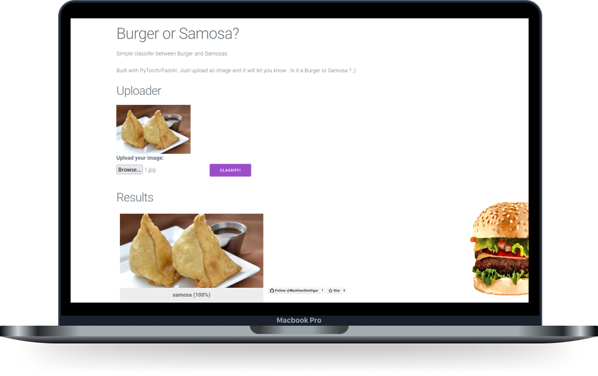

# Burger / Samosa Classifier

This was built with PyTorch/FastAI for the Machine Learning part and Flask as a Webserver. 
For containerization and easy deployment I used Docker.
The dataset used for building the model is Food-101 Dataset which is provided by FastAI
it contains many images of food and i choose the images of Samosa and Burger for building a CNN Classifier.

Food101 Dataset link : https://data.vision.ee.ethz.ch/cvl/datasets_extra/food-101/

## Open in Google colab

[](https://colab.research.google.com/drive/1XkYIN_CO_MkoxYRTL44x661P9uXmyFX6#scrollTo=FxzIJWfEkKD8)

## Train Model locally 

Make sure you have installed latest libraries of Pytorch,fastai and your gpu is cuda enabled and its compute capability is above 3.0
check here : https://developer.nvidia.com/cuda-gpus

Clone the project

```bash
  git clone https://github.com/ManthanShettigar/SamosaBurger-CNN-Classifier.git
```

Go to the project directory

```bash
  cd my-project
```

Run model via jupyter-notebook

```bash
  jupyer-notebook
```

  
## Deployment

Command to launch the container:
```bash
docker build -t cburger_samosa_classifier . && docker run --rm -it -p 5000:5000 burger_samosa_classifier

```

  
## Screenshots




## Live Website

https://foodclassifier-nalg.onrender.com/

